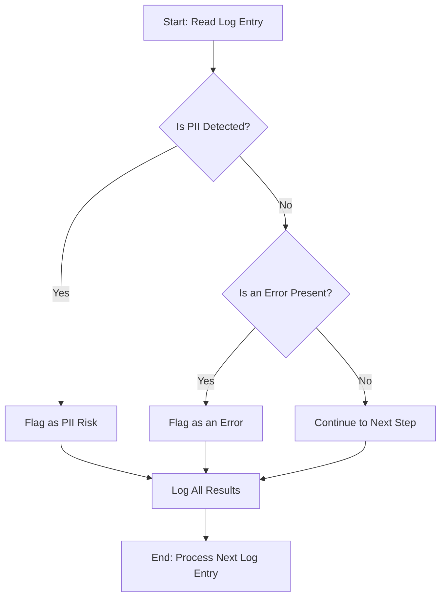

# Chatbot Monitoring Flow
This document details the step-by-step process of the monitoring.py script. The flow is designed to analyze raw chatbot logs, detect potential issues, and provide clear output for engineers and product managers.
## Flow Diagram
The diagram below illustrates the sequence of operations for each log entry processed by the monitoring script.

## Process Steps
Ingest Log Entry: The script reads one line at a time from the source of chatbot responses (e.g., mock_chatbot_logs.txt).

Measure Latency: A timer starts as soon as a new log entry is received to measure the time it takes to process the entry.

Detect PII: A regular expression engine checks the log entry for patterns that match common PII formats, such as email addresses and phone numbers. If a match is found, the log entry is flagged.

Check for Errors: The log entry is inspected for keywords like "ERROR" to determine if the chatbot failed to generate a response. If found, the entry is flagged as an error.

Log Results: The script generates a comprehensive log entry that includes the measured latency, whether PII was detected, and if an error occurred. This information is saved to a log file for review.

Repeat: The process continues for all log entries, providing a full report on the chatbot's performance and safety.